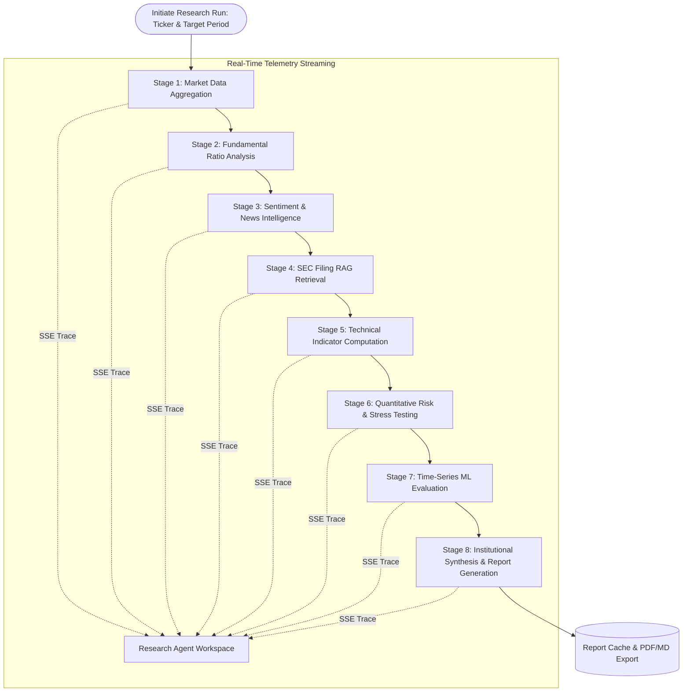

# FinSight AI: Multi-Stage Autonomous Research Agent Architecture

## 1. Executive Summary

The FinSight AI Autonomous Research Agent conducts institutional-grade, multi-stage equity analysis that mirrors the rigorous workflow of a Wall Street equity research associate. Rather than executing a single, unconstrained prompt, the agent coordinates an **8-stage deterministic execution pipeline**, streaming real-time stage progress, telemetry logs, and intermediate calculations to the client via Server-Sent Events (SSE).



---

## 2. The 8-Stage Research Pipeline

### Stage 1: Market Data Aggregation
- **Input**: Ticker symbol (e.g., `AAPL`, `MSFT`, `NVDA`).
- **Actions**: Retrieves 252 trading days of OHLCV time-series data, average daily volume (ADV), 52-week high/low bounds, and intraday price dynamics.
- **Output Artifact**: Structured price series and summary volume stats.

### Stage 2: Fundamental & Valuation Analysis
- **Actions**: Evaluates balance sheet, cash flow statement, and income statement fundamentals:
  - Price-to-Earnings (P/E), EV/EBITDA, Price-to-Book (P/B).
  - Return on Equity (ROE), Return on Invested Capital (ROIC).
  - Free Cash Flow (FCF) yield and operating margin health.
- **Output Artifact**: Fundamental ratio scorecard and industry benchmark comparison.

### Stage 3: Sentiment & Media Intelligence
- **Actions**: Pulls recent earnings call transcripts and press releases. Executes FinBERT polarity scoring across text segments.
- **Output Artifact**: Net sentiment score, positive/neutral/negative probability breakdown, and key tone drivers.

### Stage 4: SEC Filing RAG Grounding
- **Actions**: Formulates targeted semantic queries against the indexed 10-K and 10-Q filings in the vector store.
- **Output Artifact**: Cited disclosures covering Item 1A (Risk Factors), Item 7 (MD&A), and notes on litigation/tax contingencies.

### Stage 5: Technical Indicator Computation
- **Actions**: Computes rolling quantitative technical indicators:
  - 14-day Relative Strength Index (RSI).
  - Moving Average Convergence Divergence (MACD, 12, 26, 9-day signal).
  - 20-day Bollinger Bands (2 standard deviation envelope).
  - 50-day and 200-day Simple Moving Average crossovers (Golden/Death Cross detection).
- **Output Artifact**: Technical momentum score and support/resistance levels.

### Stage 6: Quantitative Risk & Stress Testing
- **Actions**: Runs portfolio risk algorithms:
  - Annualized Volatility ($\sigma$).
  - Sharpe Ratio and Sortino Ratio (downside risk adjusted).
  - Maximum Drawdown (MDD) calculation.
  - Value at Risk (VaR 95% & 99% parametric and historical).
  - Conditional Value at Risk (CVaR / Expected Shortfall).
  - CAPM Beta relative to market index.
- **Output Artifact**: Risk profile matrix and tail-risk exposure metrics.

### Stage 7: Predictive Directional ML Evaluation
- **Actions**: Trains non-anticipative temporal machine learning models (Random Forest and Gradient Boosting) on engineered financial features. Evaluates test set directional accuracy, ROC-AUC, and feature importances.
- **Output Artifact**: Out-of-sample directional signal, model confidence, and top predictive features.

### Stage 8: Institutional Equity Research Report Synthesis
- **Actions**: The LLM reasoning engine synthesizes findings from Stages 1 through 7 into a 14-section institutional research report:
  1. Executive Summary & Investment Thesis
  2. Valuation & Target Price Estimate
  3. Catalyst Calendar & Key Drivers
  4. Business Overview & Revenue Segmentation
  5. Fundamental & Ratio Deep Dive
  6. Competitive Moat & Industry Positioning
  7. Technical Analysis & Momentum Profile
  8. Sentiment & News Cycle Evaluation
  9. SEC Filing & Regulatory Review
  10. Risk Profile & Stress Test Results
  11. Machine Learning Predictive Outlook
  12. Scenario Analysis (Bull, Base, Bear)
  13. ESG & Corporate Governance Note
  14. Mandatory Regulatory Disclaimers

---

## 3. Streaming Protocol & Event Schema

The research agent exposes an SSE stream at `GET /api/v1/agents/research/{ticker}/stream`. The client consumes standard `text/event-stream` messages:

```json
event: stage_start
data: {"stage": 3, "name": "Sentiment & News Intelligence", "timestamp": "2026-09-09T21:00:00Z"}

event: log
data: {"stage": 3, "level": "INFO", "message": "Evaluating 24 recent news releases with FinBERT model"}

event: stage_complete
data: {"stage": 3, "status": "COMPLETED", "duration_ms": 142, "summary": "Sentiment positive (+0.64)"}

event: final_report
data: {"ticker": "AAPL", "report_markdown": "# Institutional Equity Research Report...", "generated_at": "2026-09-09T21:00:02Z"}
```

---

## 4. Auditability & Export Formats

All generated research runs are assigned a unique deterministic `run_id`.
- **Markdown Export**: Direct markdown string with LaTeX mathematical equations.
- **JSON Export**: Complete telemetry record including raw stage inputs, calculated outputs, and intermediate metrics for integration into quantitative execution management systems (EMS).
