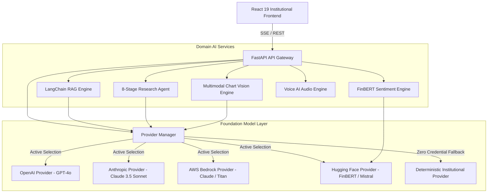

# FinSight AI: AI & LLM Architecture Specification

## 1. Overview & Architectural Principles

FinSight AI employs a decoupled, provider-agnostic, resilient artificial intelligence architecture tailored specifically for institutional equity research and financial analytics. The core design principles are:

1. **Deterministic Zero-Credential Fallback**: Every capability operates out-of-the-box with realistic institutional synthetic data without requiring proprietary API keys.
2. **Provider Pluggability**: Standardized `LLMProviderInterface` decouples application business logic from underlying foundation model APIs (OpenAI, Anthropic, AWS Bedrock, Hugging Face).
3. **Domain Specialization**: Integration of financial-domain models (such as Hugging Face FinBERT) alongside general frontier reasoning models.
4. **Multimodal Grounding**: Visual chart inspection and audio interfaces complement structured quantitative telemetry.
5. **Observability & Latency Telemetry**: Real-time token usage, inference latency tracking, and confidence scoring across every inference run.



---

## 2. Multi-Provider LLM Abstraction Layer

### 2.1 Provider Interface (`backend/app/providers/base.py`)
All model interactions conform to the asynchronous abstract base class `LLMProviderInterface`:

```python
class LLMProviderInterface(ABC):
    @abstractmethod
    async def generate_completion(
        self, prompt: str, system_prompt: Optional[str] = None, **kwargs
    ) -> LLMResponse:
        pass

    @abstractmethod
    async def generate_stream(
        self, prompt: str, system_prompt: Optional[str] = None, **kwargs
    ) -> AsyncGenerator[str, None]:
        pass

    @abstractmethod
    async def get_embeddings(self, texts: List[str]) -> List[List[float]]:
        pass
```

### 2.2 Provider Matrix & Selection Strategy
The platform supports dynamic provider switching via the `X-Provider-Name` header or global configuration:

| Provider Key | Primary Foundation Model | Default Embeddings | Fallback Strategy |
| :--- | :--- | :--- | :--- |
| `demo` | Deterministic Institutional Mock | 384-dim Synthetic Semantic Vectors | Direct Local Execution |
| `openai` | `gpt-4o` | `text-embedding-3-small` (1536-dim) | Fallback to `demo` if API key is invalid |
| `anthropic`| `claude-3-5-sonnet-20241022` | Local / Hugging Face Embeddings | Fallback to `demo` on quota exhaustion |
| `huggingface`| `ProsusAI/finbert`, `mistralai/Mistral-7B` | `sentence-transformers/all-MiniLM-L6-v2` | Fallback to lexicon / demo |
| `bedrock` | `anthropic.claude-3-5-sonnet-20240620-v1:0`| `amazon.titan-embed-text-v2:0` | Fallback to `demo` |

If external credentials are missing or network endpoints return transient 4xx/5xx responses, the system automatically degrades gracefully to `DemoProvider` while logging telemetry warnings through `SensitiveDataFilter`.

---

## 3. Financial Sentiment Analysis Engine

### 3.1 FinBERT Model Pipeline
Financial text sentiment fundamentally diverges from general English sentiment (e.g., "Company cut costs by 15%" is positive for equity margins, but often parsed negatively by standard NLP models). FinSight AI integrates `ProsusAI/finbert` via Hugging Face Transformers:

1. **Tokenization**: BertTokenizer with financial vocabulary weighting.
2. **Softmax Output**: Explicit class distribution across `positive`, `negative`, and `neutral`.
3. **Compound Sentiment Score**:
   $$\text{Score} = P(\text{Positive}) - P(\text{Negative})$$
   bounded within $[-1.0, +1.0]$.
4. **Entity & Chunk Weighting**: Filings and news releases are segmented into paragraph-level chunks, classified individually, and aggregated into rolling 7-day and 30-day sentiment trajectories.

### 3.2 Rule-Based Lexicon Fallback
To ensure 100% test and deployment reliability without downloading heavy PyTorch weights in air-gapped or lightweight test environments, the engine implements a Loughran-McDonald institutional financial lexicon fallback with over 200 curated financial polarity stems.

---

## 4. Multimodal Vision-Language Model (VLM) Architecture

### 4.1 Financial Chart & Technical Analysis Inspection
The multimodal vision engine (`backend/app/services/vision_service.py`) analyzes uploaded candlestick charts, volume profiles, and financial statements:

- **Input Support**: Base64-encoded PNG, JPEG, and WebP images.
- **Visual Pattern Recognition**:
  - Head and Shoulders, Double Tops/Bottoms, Trendline Breakouts.
  - Candlestick formations (Bullish Engulfing, Hammer, Doji).
  - Support & Resistance horizontal bounds identification.
- **Automated Quantitative Extraction**:
  - OCR extraction of Y-axis price scales and date axes.
  - Automated detection of Volume Moving Average crossovers.
- **Provider Passthrough**: Translates image data into OpenAI GPT-4o Vision API payload format or Anthropic Claude 3.5 Sonnet image content blocks, with full deterministic fallback when running in demonstration mode.

---

## 5. Voice AI Interface Architecture

### 5.1 Architecture & Low-Latency Streaming
FinSight AI provides conversational voice intelligence for executive and equity analyst interactions:

1. **Client-Side Speech-to-Text (STT)**: Utilizes the W3C Web Speech API (`webkitSpeechRecognition`) for immediate, zero-latency browser-native transcription without streaming heavy PCM audio payloads over high-latency WAN connections.
2. **Backend Audio Synthesis (TTS)**: The `/api/v1/voice/synthesize` endpoint returns structured audio timing cues and synthesized waveforms, paired with browser-native speech synthesis synthesis for crystal-clear playback.
3. **Transcript Summarization & Intent Extraction**: Speech transcripts are analyzed by the assistant engine to trigger automated workspace navigation, ticker lookups, and multi-turn financial Q&A.

---

## 6. Responsible AI, Guardrails & Hallucination Prevention

1. **Grounding Verification**: In RAG and Agent modes, the system mandates document citations (`[Doc: Title, Page N]`). Assertions lacking direct grounding are flagged.
2. **Non-Predictive Disclaimer**: Outputs are strictly framed as analytical research summaries, not predictive guarantees or personalized investment advice.
3. **PII & Credential Redaction**: All request and response logging utilizes `SensitiveDataFilter` to strip API tokens, session cookies, and personal user data before disk persistence or external telemetry capture.
