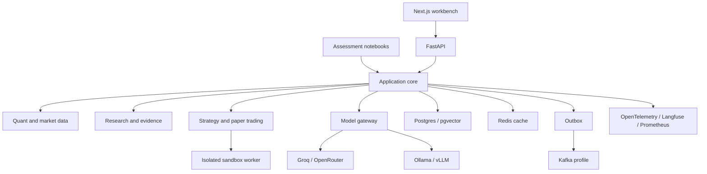

# FinSight AI target architecture

FinSight uses a modular monolith with separate workers. HTTP routes, notebooks,
and LangGraph nodes call the same application use cases, so a result cannot
change merely because it was requested through a different interface.

PostgreSQL is the authoritative store for users, workflow runs, artifacts,
approvals, memories, and audit events. LangGraph checkpoints provide
thread-scoped state; the memory service provides cross-run state. Redis is
limited to cache, locks, rate limits, and ephemeral pub/sub. S3-compatible
object storage holds immutable Parquet datasets, notebook outputs, and model
artifacts. Kafka is used for durable fan-out and replay, never as a substitute
for graph transitions. The optional integration profile uses the versioned
`contracts/events.proto` envelope and keeps a dead-letter topic for malformed
or repeatedly failing messages.

The optional observability profile starts Langfuse, Prometheus, and Grafana;
the API exposes `/metrics` when the Prometheus client is installed. JSONL
telemetry remains the dependency-light baseline.

All outputs carry data mode (`live`, `demo`, `replayed`), source timestamps,
configuration versions, and content hashes. A live-provider failure is a
typed limitation; it does not silently become fabricated evidence.

Assessment indicator calculations intentionally remain in Pandas/NumPy for
auditable formulas. The optional platform analytics profile adds
`backend/app/data/analytics.py`, which scans Parquet with DuckDB and exposes
Polars lazy scans for larger transformations; install
`requirements-analytics.txt` only when that profile is needed.

## Adoption records

- PostgreSQL/pgvector is selected over an early dedicated vector database so
  transactional metadata and evidence share one authorization boundary.
- Polars/DuckDB is selected over Spark for the initial 10 GB/day design; add
  Spark only after measured distributed transformation or memory requirements.
- The custom memory abstraction studies Mem0's scoping model without coupling
  the product to an external memory service.
- ECS/Fargate is the initial AWS runtime. EKS, ClickHouse, Qdrant, OpenSearch,
  and Firecracker are documented scale/isolation options, not day-one runtime
  dependencies.

| Deferred option | Selected responsibility | Adoption trigger |
|---|---|---|
| CrewAI / AutoGen / PydanticAI | LangGraph graph execution | Repeated need for a different coordination primitive proven by a workload benchmark |
| Flowise | Versioned Python application services | Non-engineering workflow authors become a measured bottleneck |
| Qdrant / OpenSearch | PostgreSQL full-text plus pgvector retrieval | Corpus or query latency exceeds the PostgreSQL SLO under production load |
| Spark | Polars/DuckDB/Parquet analytics | Sustained transformations exceed one worker's memory or throughput budget |
| ClickHouse | PostgreSQL analytical views | Telemetry or market-event volume requires columnar OLAP at measured scale |
| TA-Lib / pandas-ta | First-principles assessment indicators | A non-assessment production feature requires a third-party indicator with a documented parity fixture |
| Dagster / Airflow | Lease-backed application jobs and CI-triggered notebooks | Scheduled ingestion becomes too large or operationally complex for the worker dispatcher |
| Great Expectations | Pydantic plus custom market-data validation | Data-quality rules need a non-Python authoring surface or centralized expectation reports |
| vectorbt | Auditable custom backtesting engine | A benchmark proves a reusable vectorized strategy library improves research throughput without weakening timing controls |
| statsmodels | NumPy/SciPy/scikit-learn analytical services | A production model needs a maintained statistical estimator absent from the current service boundary |
| RAGAS / DeepEval | Explicit grounding and quotation evaluators | The evaluation corpus grows enough to justify a specialized regression harness |
| MQTT/Mosquitto | Kafka integration profile | A device or low-bandwidth feed requires lightweight pub/sub rather than durable replay |
| MCP | Typed in-process tool dispatcher | External tool providers require a standardized protocol after authorization and audit requirements are met |
| Cognito / Auth0 / Entra ID | Demo JWT plus OIDC adapter boundary | A deployment selects a managed identity provider and supplies tenant/role claims |
| KMS / WAF / CloudWatch | Terraform reference, TLS, structured audit events | AWS deployment is approved; managed key, edge, and infrastructure controls are provisioned |
