# FinSight AI - System Architecture

## 1. High-Level Architecture

FinSight AI is built as an enterprise monorepo combining a high-performance Python FastAPI backend, a React 19 + TypeScript institutional frontend, a LangChain RAG vector retrieval system, and AWS cloud infrastructure.

```mermaid
graph TD
    Client[React + TypeScript Institutional Frontend] -->|REST / SSE Streaming| API[FastAPI Application Gateway]

    subgraph Backend Core Services
        AuthService[Auth & Demo Token Service]
        MarketService[Market Data & Parquet Pipeline]
        QuantEngine[Quantitative Analytics Engine]
        MLEngine[Time-Series ML Engine]
        SentimentService[Hugging Face Sentiment Engine]
        DocIntelService[Document Intelligence & Diff Service]
        RAGEngine[LangChain RAG Engine & Injection Filter]
        AgentEngine[Multi-Stage Research Agent]
        WorkflowEngine[LangGraph StateMachine Engine]
        StrategyDev[Developer Agent & AST Sandbox]
        QAAgent[QA Perturbation & Invariant Engine]
        BacktestEngine[Deterministic Backtesting Engine]
        ApprovalService[Human Approval Gate Service]
        ShadowEngine[Shadow Paper Simulation Engine]
        MemoryService[Persistent Memory & Vector Store]
        VoiceService[Voice AI Service]
        VisionService[Multimodal VLM Service]
    end

    API --> AuthService
    API --> MarketService
    API --> QuantEngine
    API --> MLEngine
    API --> SentimentService
    API --> DocIntelService
    API --> RAGEngine
    API --> AgentEngine
    API --> WorkflowEngine
    API --> MemoryService
    API --> ApprovalService
    API --> ShadowEngine
    API --> VoiceService
    API --> VisionService

    subgraph Multi-Provider AI Abstraction
        ProviderManager[LLM Provider Manager]
        DemoProv[DemoProvider - Zero Credentials]
        OllamaProv[OllamaProvider - Local Air-Gapped]
        OpenAIProv[OpenAI GPT-4o Provider]
        AnthropicProv[Anthropic Claude 3.5 Provider]
        HFProv[Hugging Face Model Provider]
        BedrockProv[AWS Bedrock Provider]
    end

    RAGEngine --> ProviderManager
    AgentEngine --> ProviderManager
    WorkflowEngine --> ProviderManager
    ProviderManager --> DemoProv
    ProviderManager --> OllamaProv
    ProviderManager --> OpenAIProv
    ProviderManager --> AnthropicProv
    ProviderManager --> HFProv
    ProviderManager --> BedrockProv

    subgraph Data & Storage Architecture
        DB[(PostgreSQL + pgvector / SQLite Demo)]
        Cache[(Redis Cache / In-Memory Store)]
        Storage[(Local Storage / AWS S3 Filings)]
    end

    API --> DB
    MarketService --> Cache
    RAGEngine --> Storage
```



---

## 2. Directory Layout
```
/
├── backend/                  # FastAPI Microservice
│   ├── app/
│   │   ├── analytics/        # Python quantitative finance calculations
│   │   ├── api/v1/           # REST & SSE routers for all domains
│   │   ├── core/             # Logging, security, middleware
│   │   ├── database/         # SQLAlchemy async engine & pgvector
│   │   ├── ml/               # Time-series machine learning pipelines
│   │   ├── models/           # SQLAlchemy entities & Pydantic v2 schemas
│   │   ├── providers/        # LLM Provider abstraction & DemoProvider
│   │   ├── rag/              # LangChain RAG vector retrieval engine
│   │   ├── agents/           # Multi-Stage AI Research Agent
│   │   ├── services/         # Market data, sentiment, document intelligence
│   │   └── main.py           # Application entrypoint & CORS middleware
│   ├── requirements.txt      # Python dependencies
│   └── Dockerfile            # Multi-stage Python 3.12 container
├── frontend/                 # React + TypeScript Frontend
│   ├── src/
│   │   ├── api/              # Typed API client connecting to backend
│   │   ├── components/       # Reusable charts, navbar, sidebar, banners
│   │   ├── pages/            # 14 distinct FinTech intelligence workspaces
│   │   ├── types/            # TypeScript interfaces
│   │   ├── index.css         # Modern Vanilla CSS design system
│   │   └── App.tsx           # Router and QueryClientProvider
│   ├── nginx.conf            # Nginx SPA configuration
│   └── Dockerfile            # Production multi-stage Nginx container
├── infrastructure/           # Cloud Infrastructure as Code
│   └── terraform/            # AWS ECS, RDS pgvector, Redis, S3, CloudFront
├── docs/                     # Technical architecture & demo documentation
├── tests/                    # Backend pytest and frontend vitest test suites
├── .github/workflows/ci.yml  # GitHub Actions CI pipeline
├── docker-compose.yml        # Local multi-container development environment
└── README.md                 # Primary technical documentation
```
