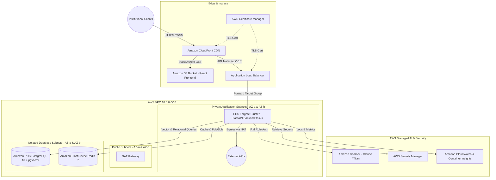

# FinSight AI: AWS Cloud Enterprise Architecture

## 1. Overview & Cloud Strategy

FinSight AI is architected for enterprise cloud deployment on **Amazon Web Services (AWS)** using a fully serverless, highly available, Multi-AZ infrastructure model managed by Terraform. The architecture separates static frontend delivery from containerized microservices and stateful data stores.



---

## 2. Infrastructure Components

### 2.1 Edge Delivery & Static Hosting
- **Amazon CloudFront**: Global CDN with TLS 1.3 termination, edge compression (Brotli/Gzip), and DDoS mitigation via AWS Shield Standard.
- **Amazon S3**: Private bucket hosting the compiled React 19 production bundle (`frontend/dist`), accessible strictly via CloudFront Origin Access Control (OAC).

### 2.2 Application Ingress & Compute
- **Application Load Balancer (ALB)**:
  - Multi-AZ public routing.
  - Path-based routing: `/api/*` routed to backend target group; other paths routed to CloudFront S3 origin.
  - Native support for Server-Sent Events (SSE) with extended idle timeout (`300s`) for multi-stage research agent streaming.
- **AWS ECS on AWS Fargate**:
  - Serverless container execution eliminating EC2 management overhead.
  - Task definition configured with 1.0 vCPU and 2.0 GB RAM per replica.
  - Target tracking auto-scaling policy based on average CPU utilization (scale out at >70%).
  - Zero hardcoded credentials: tasks assume fine-grained IAM execution roles.

### 2.3 Stateful Data & Caching Tier
- **Amazon RDS for PostgreSQL 16 (Multi-AZ)**:
  - Enabled with `pgvector` extension for vector similarity search.
  - Automated backups, point-in-time recovery (PITR), and encryption-at-rest via AWS KMS.
  - Provisioned in isolated private database subnets with no public IPv4 route.
- **Amazon ElastiCache for Redis 7**:
  - In-memory cache for market ticker quotes, RAG embedding caches, and rate-limiting counters.
  - Multi-node replication group with automatic failover.

### 2.4 Enterprise AI & Security Services
- **Amazon Bedrock**: Direct private VPC access to Anthropic Claude 3.5 Sonnet and Amazon Titan Embeddings without sending data over the public internet.
- **AWS Secrets Manager**: Automated rotation of JWT signing secrets, database credentials, and external third-party API keys.
- **AWS Key Management Service (KMS)**: Customer Managed Keys (CMK) ensuring envelope encryption across S3, EBS volumes, and RDS tables.

---

## 3. Terraform Infrastructure as Code (IaC)

All cloud resources are codified within `infrastructure/terraform/`:

| Terraform File | Managed Resources |
| :--- | :--- |
| `main.tf` | AWS provider configuration, S3 state backend, and regional settings |
| `variables.tf` | Environment parameter declarations (VPC CIDRs, container image tags) |
| `vpc.tf` | VPC, public/private/database subnets, NAT Gateways, Internet Gateway |
| `ecs.tf` | ECS Cluster, Task Definitions, Fargate Service, Auto-Scaling Targets |
| `rds.tf` | RDS DB Subnet Group, PostgreSQL 16 instance with pgvector parameter group |
| `s3.tf` | S3 bucket for React static assets, Bucket Policy, OAC configuration |
| `cloudfront.tf` | CloudFront distribution, cache behaviors, error page rewrites for SPA routing |
| `outputs.tf` | Output ALB DNS name, CloudFront domain name, RDS endpoint |

### Deployment Command Flow
```bash
cd infrastructure/terraform
terraform init
terraform plan -var="environment=production" -out=tfplan
terraform apply tfplan
```
