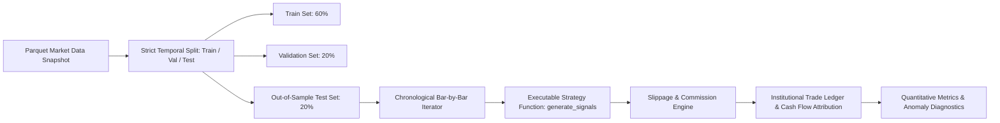

# FinSight AI - Deterministic Backtesting Engine

## 1. Engine Philosophy: Institutional Reproducibility
Many commercial backtesting tools produce artificially inflated performance figures due to look-ahead bias, unrealistically zero transaction friction, and in-sample overfitting.

FinSight AI's **Deterministic Backtesting Engine** (`backend/app/backtesting/engine.py` and `backend/app/analytics/engine.py`) enforces institutional-grade quantitative discipline:
1. **Strict Non-Anticipative Chronology**: Data is consumed strictly point-in-time ($T_0 \le t \le T$). Information after time $t$ is mathematically inaccessible to the strategy logic.
2. **Deterministic Execution**: Given identical price series, slippage parameters, and strategy logic, the engine guarantees bitwise reproducible equity curves and trade ledgers.
3. **Explicit Market Friction**: Every simulated trade incurs basis-point slippage, transaction commissions, and regulatory exchange fees.

---

## 2. Temporal Partitioning (Train / Validation / Test)
Unlike generic machine learning tasks where data points are independently and identically distributed (IID), financial time series exhibit autocorrelation, volatility clustering, and regime shifts. Random shuffling is strictly forbidden.

- **Training Partition (60%)**: In-sample parameter estimation and indicator baseline formulation.
- **Validation Partition (20%)**: Hyperparameter tuning, stop-loss / take-profit calibration, and sensitivity audits.
- **Out-of-Sample Test Partition (20%)**: Final blind evaluation on unseen market regimes. Only out-of-sample metrics are reported to the investment committee.

---

## 3. Market Friction Model

### 3.1 Slippage Formulation
Slippage models market impact and bid-ask spread friction. The effective fill price $P_{\text{fill}}$ is determined by:
$$P_{\text{fill}} = P_{\text{close}} \times \left(1 \pm \frac{\text{slippage\_bps}}{10,000}\right)$$
- Long Buy Orders: Executed at an unfavorable premium ($+ \text{slippage\_bps}$).
- Short Sell Orders: Executed at an unfavorable discount ($- \text{slippage\_bps}$).
- Default Baseline: **5.0 bps** for mega-cap liquid equities ($0.05\%$).

### 3.2 Transaction Costs & Commissions
- Fixed commission: \$1.00 per trade or **2.0 bps** variable cost.
- Cumulative transaction costs are deducted from cash reserves on each execution bar.

---

## 4. Performance & Risk Attribution Metrics

The engine calculates institutionally recognized performance and risk metrics:
- **Total Return & CAGR**: Cumulative compounding return and annualized growth rate.
- **Sharpe Ratio (Annualized)**: Excess return over risk-free rate (assumed $4.0\%$) normalized by annualized standard deviation ($\sqrt{252}$).
- **Sortino Ratio**: Excess return normalized strictly by downside standard deviation (penalizing downside volatility while rewarding upside volatility).
- **Maximum Drawdown (MDD) & Peak-to-Trough Duration**: Peak historical equity degradation and recovery periods.
- **Hit Rate (Win Ratio)**: Percentage of closed round-trip trades yielding positive net P&L after all frictions.
- **Profit Factor**: Gross profits divided by gross losses ($\sum \text{Gains} / |\sum \text{Losses}|$).
- **Portfolio Turnover**: Total dollar value traded divided by average portfolio equity.
- **Jensen's Alpha & Beta**: Benchmark-relative excess return and market co-movement measured against S&P 500 (`SPY`).

---

## 5. Automated QA & Look-Ahead Bias Perturbation Check
Before any strategy reaches backtesting, the **QA Agent** (`backend/app/strategy/qa_agent.py`) executes an automated look-ahead perturbation audit:
1. The strategy is run on a baseline price series $P_t$, recording signal vector $S_t$.
2. Future prices ($t + 5$ to $T$) are perturbed with an extreme adverse shock ($P_{\text{future}} \times 0.05$).
3. If the signal generated at bar $t$ ($S_t$) changes in response to future modifications, the strategy is flagged for look-ahead leakage (`shift(-k)` or forward-peeking bugs) and immediately rejected with a zero score.
