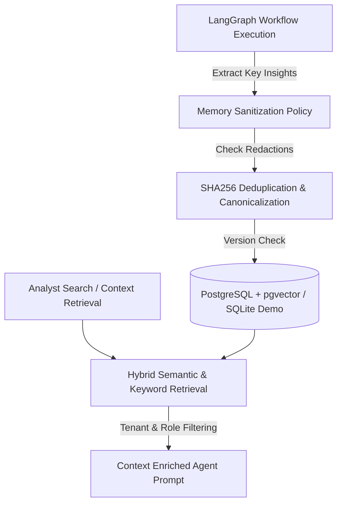

# FinSight AI - Persistent Memory Architecture

## 1. Overview & Philosophy
Institutional investment research requires memory that persists across workflow runs, user sessions, and analyst interactions without contaminating state across tenants or leaking sensitive credentials. 

In FinSight AI, the persistent memory layer is decoupled from transient workflow state. While LangGraph manages intermediate artifacts for a specific execution run, the **Persistent Memory Service** (`backend/app/memory/`) indexes, versions, audits, and retrieves high-value analytical findings, validated strategy candidates, backtest outcomes, and researcher notes.

---

## 2. Core Architectural Guarantees

### 2.1 Complete Separation of Duties & Tenants
- **Tenant Isolation**: Every memory record carries an explicit `tenant_id` (defaulting to institutional workspace ID). Queries are strictly scoped: an analyst or agent in `tenant_corp_a` cannot inspect memories originating from `tenant_corp_b`.
- **RBAC & Role Gating**: Memories carry `access_level` tags (`PUBLIC`, `INTERNAL`, `RESTRICTED`, `CONFIDENTIAL`). The retrieval engine rejects records exceeding the querying agent's credential tier.

### 2.2 Invariant Secret Sanitization
Before any string is persisted to memory or vectorized, it passes through the deterministic `MemorySanitizationPolicy`:
- **API Key Patterns**: Scrubbing regex patterns for OpenAI (`sk-[a-zA-Z0-9]{32,}`), AWS Access Keys (`AKIA[0-9A-Z]{16}`), Anthropic tokens, and Hugging Face tokens (`hf_[a-zA-Z0-9]{34,}`).
- **Authentication Credentials**: Password, bearer token, and private key redactions replacing matching substrings with `[REDACTED_SECRET]`.
- **SEC Filing Raw Text Scrubbing**: Stripping unvalidated environment blocks or configuration dumps.

### 2.3 Cryptographic Content Deduplication & Versioning
- **SHA256 Fingerprint**: Every memory payload calculates a deterministic SHA-256 hash of its normalized content and metadata tuple.
- **Version Tracking**: If an insight or strategy specification is updated for a given entity (e.g., `AAPL_MOMENTUM_SPEC`), the memory service increments the `version` counter and links the superseded record, preventing silent overwrite while maintaining calculation lineage.

---

## 3. Storage Layer: Dual-Engine Compatibility
The memory layer is designed with a pluggable interface supporting both full-scale institutional cloud deployments and zero-dependency local evaluations:

1. **Production Engine (PostgreSQL + pgvector)**:
   - Uses native `vector(1536)` or `vector(384)` columns with `ivfflat` / `hnsw` indexes for sub-millisecond approximate nearest neighbor (ANN) cosine similarity search.
   - Relational ACID transactions guarantee that memory writes are atomically committed with strategy specifications.
2. **Local Evaluation Engine (In-Memory / SQLite Fallback)**:
   - In zero-credential local demo mode, vector similarity is computed deterministically via normalized NumPy cosine dot products (`A · B / (||A|| * ||B||)`).
   - Zero external services required; runs out-of-the-box in CI and local developer machines.

---

## 4. API & Tool Interface
Agents and frontend components interact with the memory service via typed endpoints:
- `POST /api/v1/memory/items`: Store an insight, research finding, or strategy note with tags and provenance.
- `GET /api/v1/memory/items/{ticker}`: Retrieve chronological memory lineage for an asset.
- `POST /api/v1/memory/search`: Execute semantic vector search across historical institutional memories.
