# FinSight AI: Retrieval-Augmented Generation (RAG) Architecture

## 1. Overview & Problem Statement

Financial analysts require fast, verifiable insights from thousands of pages of SEC filings (Forms 10-K, 10-Q, 8-K), earnings call transcripts, and equity research notes. Naive Large Language Model prompting causes severe risks in finance, notably **hallucinated metrics, stale data, and untraceable claims**.

FinSight AI’s RAG pipeline enforces **strict semantic grounding**, associating every quantitative assertion with verifiable document citations, page numbers, and exact text excerpts.

```mermaid
flowchart TD
    subgraph Ingestion Pipeline
        Filing[SEC 10-K / 10-Q / Transcripts] --> DocParser[Document Parser & Metadata Tagging]
        DocParser --> Chunker[Recursive Chunker with Header Preservation]
        Chunker --> Embedder[Embedding Generator: MiniLM / text-embedding-3]
        Embedder --> VectorStore[(Vector Store: pgvector / NumPy Index)]
    end

    subgraph Query & Synthesis Pipeline
        UserQuery[Analyst Query + Ticker Scope] --> QueryEmbedder[Query Vector Generation]
        QueryEmbedder --> VectorSearch[Top-K Semantic Search + Cosine Similarity]
        VectorSearch --> MetaFilter[Metadata Filter: Ticker, Period, Section]
        MetaFilter --> ReRanker[Cosine Reranking & Threshold Filtering]
        ReRanker --> ContextAssembler[Context Assembler + Citation Tags]
        ContextAssembler --> LLM[Reasoning Model: GPT-4o / Claude / Demo]
        LLM --> CitedResponse[Synthesized Research Answer with Clickable Citations]
    end
```



---

## 2. Ingestion & Document Chunking Strategy

### 2.1 Chunking Parameters
Financial documents feature dense tables, footnotes, and multi-paragraph disclosures. Standard naive chunking splits tables across chunks, corrupting row/column relationships. FinSight AI implements:

- **Chunk Size**: 500 – 1,000 characters (optimized for concise SEC item paragraphs).
- **Chunk Overlap**: 100 characters (ensures sentence boundaries and transitional phrases are retained across adjacent vectors).
- **Separator Hierarchy**: `["\n\nItem ", "\n\nNote ", "\n\n", "\n", ". ", " "]` to preserve section headers and financial note integrity.

### 2.2 Metadata Schema
Every chunk stored in the vector index contains enriched metadata:

```json
{
  "chunk_id": "aapl-2024-10k-p42-c3",
  "document_id": "doc_aapl_10k_2024",
  "ticker": "AAPL",
  "title": "Apple Inc. Fiscal 2024 Form 10-K",
  "filing_type": "10-K",
  "period": "FY 2024",
  "page_number": 42,
  "section": "Item 7: MD&A - Liquidity and Capital Resources",
  "char_count": 842
}
```

---

## 3. Embedding Models & Vector Storage

### 3.1 Embedding Dimensions & Normalization
Vectors are $L_2$-normalized prior to indexing, allowing dot-product operations to yield exact cosine similarity:

$$\text{Cosine Similarity}(u, v) = \frac{u \cdot v}{\|u\|_2 \|v\|_2} = u_{\text{norm}} \cdot v_{\text{norm}}$$

| Embedding Architecture | Vector Dimensionality | Typical Use Case |
| :--- | :--- | :--- |
| `sentence-transformers/all-MiniLM-L6-v2` | 384 dimensions | Fast local CPU inference & demo fallback |
| `text-embedding-3-small` | 1536 dimensions | High-accuracy OpenAI semantic search |
| `amazon.titan-embed-text-v2:0` | 1024 dimensions | Enterprise AWS Bedrock deployments |

### 3.2 Storage Backends
1. **Local / Testing**: In-memory normalized vector array with NumPy dot-product ranking (`backend/app/rag/engine.py`). Bootstrapped deterministically at startup.
2. **Production / Docker**: PostgreSQL with `pgvector` extension (`vector(1536)` or `vector(384)`), utilizing `HNSW` (Hierarchical Navigable Small World) index for sub-10ms retrieval across hundreds of thousands of filing chunks.

---

## 4. Citation Grounding & Prompt Construction

To eliminate hallucination, the system injects strict prompt constraints when generating synthesis responses:

```text
You are a senior equity research analyst. Answer the user question using ONLY the provided context chunks below.
Every factual assertion or metric must include an in-line citation formatted exactly as:
[Doc: <Document Title>, Page <Page Number>]

If the provided context does not contain sufficient information to answer the question, state:
"The provided SEC filings do not contain sufficient verified data to answer this inquiry."
Do not extrapolate, assume, or invent figures.
```

### 4.1 Frontend Citation Linking
The React frontend parses `[Doc: ..., Page ...]` tags in assistant messages, rendering them as interactive citation tags. Clicking a citation opens the **Citation Drawer** displaying the exact original excerpt, document title, confidence score, and filing timestamp.

---

## 5. Report Comparison & Filing Diff Engine

Financial analysts frequently compare consecutive filings (e.g., Apple 2023 10-K vs. 2024 10-K) to identify subtle language modifications in risk factors or guidance.

The `/api/v1/documents/compare` endpoint:
1. Aligns corresponding sections (e.g., "Item 1A: Risk Factors") between Filing A and Filing B.
2. Performs sentence-level Levenshtein diffing and semantic divergence calculation.
3. Categorizes changes into:
   - **Critical Additions**: New risks (e.g., antitrust litigation, regulatory supply-chain tariffs).
   - **Deletions**: Omitted guarantees or resolved litigation.
   - **Semantic Drift**: Subtle tone changes from confident to cautious.
