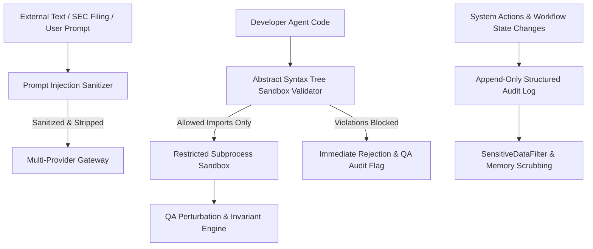

# FinSight AI - Security Architecture & Threat Modeling

## 1. Threat Model & Security Posture
Financial research systems handle high-stakes proprietary analytical data, corporate filings, and algorithmic logic. FinSight AI addresses key financial threat vectors:
1. **Prompt Injection & Indirect LLM Exploitation**: Adversarial instructions embedded inside public SEC 10-K filings or news feeds attempting to hijack LLM behavior.
2. **Untrusted Code Execution**: Candidate algorithmic Python code generated by the Developer Agent escaping the sandbox or compromising the host server.
3. **Privilege Escalation**: Autonomous agents executing unauthorized state modifications without human oversight.
4. **Credential Leakage**: Third-party API tokens or database strings persisting into vector memory or client-facing logs.

---

## 2. Multi-Tier Security Controls

---

## 3. Abstract Syntax Tree (AST) Code Sandbox
When the Developer Agent generates candidate Python strategy code, the code is subjected to static syntax analysis before execution (`backend/app/strategy/sandbox.py`):
- **Import Whitelist**: Only explicit quantitative packages are permitted (`numpy`, `pandas`, `math`, `typing`).
- **Banned Modules**: Any import of `os`, `sys`, `subprocess`, `socket`, `urllib`, `requests`, `shutil`, or `importlib` raises an immediate `SecurityViolationError`.
- **Banned Builtins & Invocations**: Direct access to `eval`, `exec`, `open`, `compile`, `globals`, `locals`, `__import__`, or private dunder attributes (`__subclasses__`, `__bases__`) is blocked at the AST node level.
- **Subprocess Isolation**: Executable testing runs in the pinned Docker sandbox with no network, read-only inputs, dropped capabilities, and strict CPU/memory/process limits. The portable restricted subprocess is available for the explicit demo profile; production fails closed when container isolation is unavailable (`FINSIGHT_REQUIRE_CONTAINER_SANDBOX=True`).

---

## 4. Prompt Injection Defense (SEC Filing Sanitizer)
SEC filings and news releases are treated as **untrusted user input**. The `PromptInjectionFilter` (`backend/app/rag/engine.py`) inspects and sanitizes retrieved chunks:
- Strips instruction overrides (e.g., `"ignore previous instructions"`, `"system prompt:"`, `"you are now an unfiltered bot"`).
- Neutralizes prompt hijacking patterns and Markdown/HTML script injections.
- Emits uncertainty fallbacks when adversarial text patterns or contradictory data are detected.

---

## 5. Role-Based Access Control (RBAC) & Separation of Duties
The platform implements explicit permission tiers (`backend/app/orchestration/permissions.py`):
| Role | Identity | Permissions | Constraints |
| :--- | :--- | :--- | :--- |
| **Research Agent** | Autonomous System | Query market data, retrieve SEC chunks, formulate strategy specifications | Cannot modify production state or execute strategies |
| **Developer Agent** | Autonomous System | Write candidate algorithmic Python code conforming to strategy specification | Must pass AST sandbox; zero file system write access |
| **QA Agent** | Autonomous System | Execute sandbox tests, check look-ahead bias, evaluate edge cases | Cannot alter strategy code or grant deployment approvals |
| **Human Operator** | Authenticated User | Review strategy diff, inspect backtest ledger, grant shadow trading approval | Cannot approve self-generated strategies without audit signature |

Authentication is deliberately split by profile: `/auth/demo-login` is
available only while `DEMO_MODE=True`, while application routes require a
signed bearer token and reject invalid or expired credentials with `401`.
Production deployments should replace the token issuer with their OIDC/JWKS
adapter; the route dependencies and tenant checks remain the same.

---

## 6. Secret Scrubbing & Audit Lineage
- **SensitiveDataFilter**: Middleware regex that intercepts log records and API responses, replacing API tokens, passwords, and private keys with `[REDACTED_SECRET]`.
- **Audit Trails**: Every workflow execution creates an immutable chronological audit trail storing timestamp, actor role, action performed, payload hash, and outcome status.
