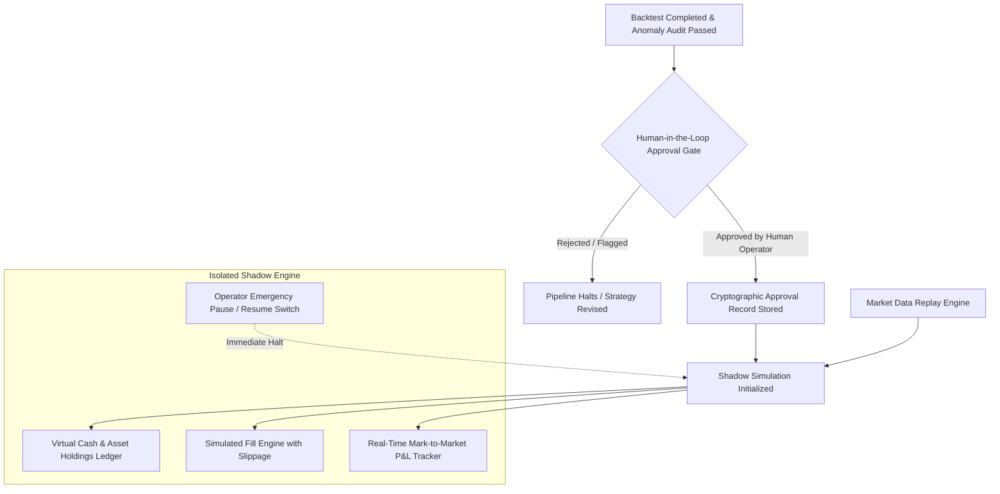

# FinSight AI - Shadow Trading & Simulation Environment

## 1. System Invariant: Zero Real-Money Execution
> [!CAUTION]
> **ABSOLUTE ARCHITECTURAL BOUNDARY**: FinSight AI is engineered exclusively for quantitative research, thesis generation, strategy evaluation, and decision support. The codebase contains **ZERO** order routing modules, FIX protocols, broker SDK integrations (e.g., Interactive Brokers, Alpaca, TD Ameritrade), or private transaction keys. It is physically incapable of placing live market orders.

The **Shadow Trading Environment** (`backend/app/shadow/service.py`) provides an isolated, realistic paper-trading sandbox allowing quantitative researchers and portfolio managers to forward-test algorithmic trading hypotheses under live or synthetic market feeds without capital risk.

---

## 2. Mandatory Human Approval Gate
No strategy can transition from backtesting into shadow simulation automatically. The LangGraph workflow enforces a hard breakpoint (`WAITING_APPROVAL`):
- **Approval Payload**: The Human Operator is presented with the complete strategy specification, source code diff, AST security scan results, backtest Sharpe ratio, maximum drawdown, and SEC evidence citations.
- **Separation of Duties**: The system enforces that the approver identity cannot match the automated generating agent identity (`system_research_agent != human_operator`).
- **Cryptographic Audit Signature**: Approval decisions store a SHA-256 hash of the exact strategy code and backtest summary, recording the operator ID, timestamp, and review rationale.

---

## 3. Virtual Portfolio & Fill Simulation
Once approved, the shadow engine instantiates an isolated virtual portfolio:
- **Starting Cash**: Configurable baseline (default \$100,000 USD virtual equity).
- **Position Tracking**: Signed integer quantities (`+` for long, `-` for short) with precise average execution prices.
- **Simulated Fill Engine**:
  - Fill prices include bid-ask spread and volume-weighted slippage based on market volatility.
  - Insufficient cash or leverage limits immediately generate `REJECTED_MARGIN` virtual order events.
  - Cash reserves earn risk-free daily interest.
- **Mark-to-Market Accounting**: Portfolio valuation updates dynamically on every tick or candle bar, tracking unrealized P&L, realized P&L, gross exposure, and cash utilization.

---

## 4. Operator Controls & Emergency Pause
The Shadow Trading Hub provides instant operational controls via authenticated API endpoints:
- `POST /api/v1/shadow/start`: Launches a shadow trading session for an approved strategy specification.
- `POST /api/v1/shadow/pause`: Instant halt of simulated signal evaluation and order processing.
- `GET /api/v1/shadow/simulations/{id}`: Returns complete real-time order history, execution fills, virtual holdings, and equity curve trajectory.
